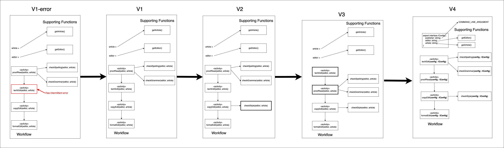

# The Temportal Version Control Demonstration Project
A project that demonstrates how to execute version control on potentially long-running Temporal Workflows

<iframe width="560" height="315" src="https://www.youtube.com/embed/9mJlyGNOxOg" title="YouTube video player" frameborder="0" allow="accelerometer; autoplay; clipboard-write; encrypted-media; gyroscope; picture-in-picture; web-share" allowfullscreen></iframe>

The project emulates a technical publishing workflow that consists of the following activities

- `getArticle()` //returns a string that is an article title
- `getEditor()` //returns a editor to assign to editing task for an article
- `proofread(techEditeditor:string, article:string)`
- `techEdit(techEditeditor:string, article:string)`
- `copyEdit(techEditeditor:string, article:string)`
- `formatEdit(techEditeditor:string, article:string)`

The project evolves the workflow scenarios over 5 versions as shown in the illustration below.



The [**first version**](https://github.com/reselbob/temporal-version-control-01/tree/V1) has an intermittent error that needs to be fixed. This version is named V1-error. The fixed version that removes the intermittent error is named V1.

The [**V2**]() version modifies the copyEdit activity by adding style checking. Style checking is implemented in a function name checkStyle(editor, article) which is internal to the activity.

The [**V3**](https://github.com/reselbob/temporal-version-control-01/tree/V3) version implements a significant change by altering the sequence in which activities are executed within the workflow. Changing the sequence of activities affects the determinism of the workflow. Thus, special measures need to be taken in how the workflow is programmed in order for the V3 version to run and not throw a fatal error.

The [**V4**](https://github.com/reselbob/temporal-version-control-01/tree/V4) version makes another significant change. It changes the signature of all the activity functions. Activity functions in prior versions of the workflow took two parameters: editor and article, The V4 version takes a new approach and passes a single parameter which is a configuration object. The configuration object has properties for the editor, article and also a new piece of information, the publisher. The name of the publisher is declared as a command line argument when the Temporal client starts the workflow. If no publisher is declared, a default value of Anonymous is assigned as the name of the publisher.


# Automatically running the various versions of the code

This project ships with a bash script that will start a new version of the demonstration code at a set interval.

The bash script requires that **Node.js** and **ts-node** are installed globally on the host machine. Also, for development purposes the Temportal CLI needs to be installed on the machine that will run the Temportal workflow.

## Installing and running the Temporal developement server on a Linux machine

`Step 1:` Run the following command in a terminal window to install the Temporal CLI:

```
curl -sSf https://temporal.download/cli.sh | sh
```

`Step 2:` Once the Temporal CLI is installed, execute the following command in the terminal window to start the Temporal development server:

```
temporal server start-dev --ip 0.0.0.0
```

The option `--ip 0.0.0.0` enables the Temportal Web UI to be accessed from a web browser runnning in an external machine. Thus to access the Temportal Web UI from a machine running at IP address 192.168.86.32, you'd enter the following in the browser's address bar: `http://192.168.86.32:8233`.

[This page](https://docs.temporal.io/application-development/foundations#run-a-development-server) on the Temporal site provides the instructions for installing the Temporal development server on MacOS and Windows.

## Getting the demonstration workflows up and running using the  `autotexecwf.sh` script

You can view the script named `autotexecwf.sh` [here](./autoexecutewf.sh). You can alter the interval by which the version of code increments up and then starts by altering the value assigned to the variable `SLEEP_PERIOD`. The default value is `3600` seconds (1 hour).

Run the following steps to run the bash script.

1. Execute `git clone https://github.com/reselbob/temporal-version-control-01.git`
2. Execute `cd temporal-version-control-01`
3. Execute `sh autoexecutewf.sh`

The script will execute all versions of the demonstration project. You'll see output similar to the following when you run the script:

```bash
Branch 'V1-error' set up to track remote branch 'V1-error' from 'origin'.
Switched to a new branch 'V1-error'
I will release a new version of the demonstration project every 150 seconds
Running V1-error at 2023-04-08 23:02:25
P_ID is 3589
V1_ERR_ID is 3591
Waiting ... on V1


Killing P_ID is 3589
Branch 'V1' set up to track remote branch 'V1' from 'origin'.
Switched to a new branch 'V1'
Running V1 at 2023-04-08 23:04:55
P_ID is 3772
V1_ID is 3770
Waiting ... on V2


Killing P_ID is 3772
Branch 'V2' set up to track remote branch 'V2' from 'origin'.
Switched to a new branch 'V2'
Running V2 at 2023-04-08 23:07:25
P_ID is 4056
V2_ID is 4054
Waiting ... on V3


Killing P_ID is 4056
Branch 'V3' set up to track remote branch 'V3' from 'origin'.
Switched to a new branch 'V3'
Running V3 at 2023-04-08 23:09:55
P_ID is 4270
V3_ID is 4268
Waiting ... on V4


Killing P_ID is 4270
Branch 'V4' set up to track remote branch 'V4' from 'origin'.
Switched to a new branch 'V4'
Running V4 at 2023-04-08 23:12:25
P_ID is 4541
V4_ID is 4539


All versions released

```

## Viewing the Web UI

You can viewe the Web UI for the project at: `http://<IP_ADDRESS>:8233`


